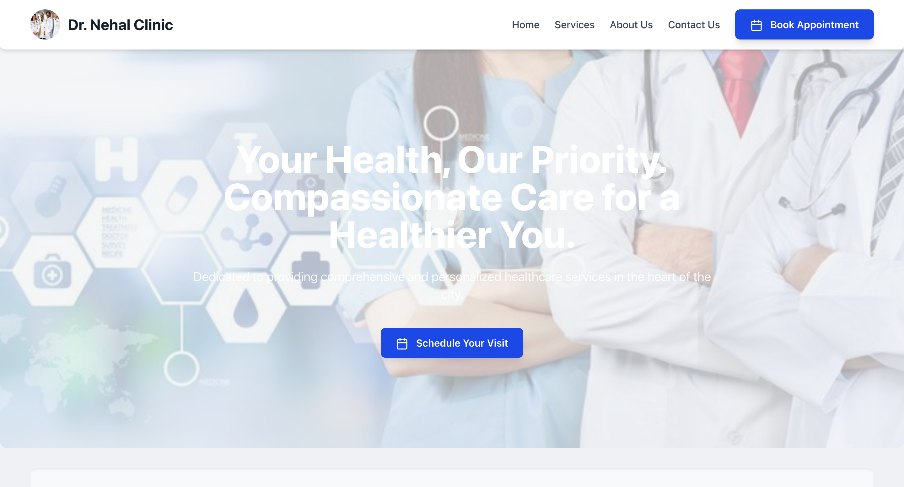
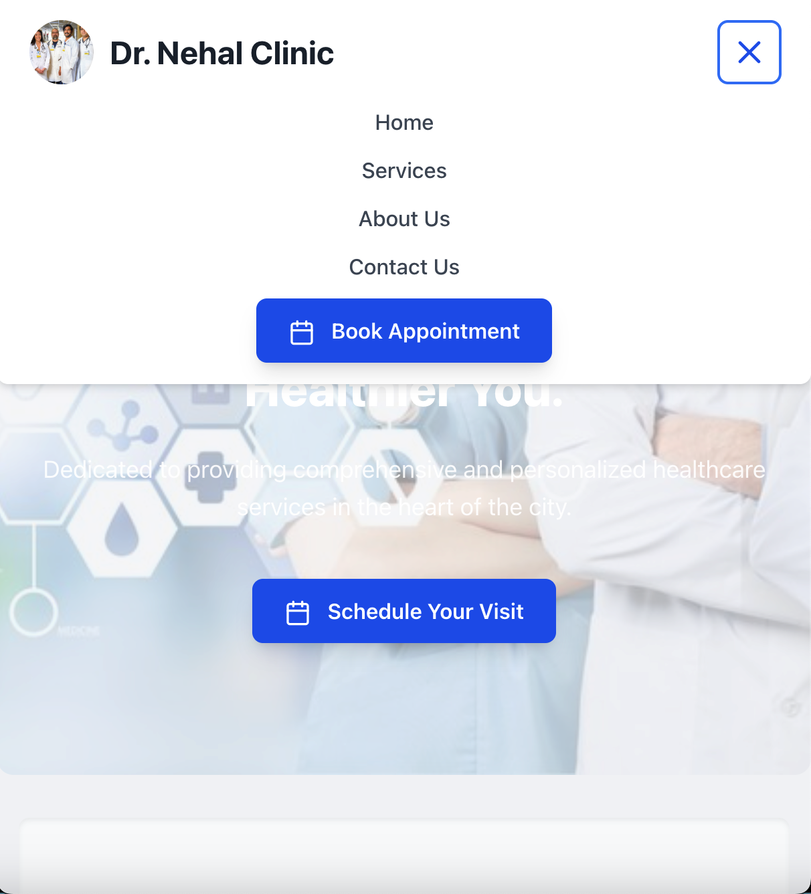

# 👩‍⚕️ Dr. [Doctor's Name] Clinic: Frontend Application

## 📝 Project Overview

This repository contains the frontend application for a general physician's website, developed using React and Tailwind CSS. The project adheres to an MVC-inspired architectural pattern, focusing on delivering a highly responsive, user-friendly, and accessible digital presence. Key features include dynamic content sections, a subtle parallax scrolling effect, and robust mobile compatibility, all designed to build patient trust and streamline appointment scheduling.

## 🚀 Getting Started

To set up and run this application locally, ensure you have Node.js and npm (or Yarn/pnpm) installed on your system.

1.  **Project Initialization:**
    Begin by creating a new React project with Vite. When prompted, select **React** as the framework and **JavaScript** as the variant. Crucially, enable **Tailwind CSS** during this step, as it will automatically configure the necessary `tailwind.config.js` and `postcss.config.js` files.

    ```bash
    npm create vite@latest my-physician-website-mvc -- --template react
    cd my-physician-website-mvc
    ```

2.  **Dependency Installation:**
    Install all required project dependencies, including `lucide-react` for scalable vector icons.

    ```bash
    npm install
    npm install lucide-react
    ```

3.  **Directory Structure Creation:**
    Establish the following MVC-inspired folder structure within your `src/` directory to organize components, data models, controllers, and assets.

    ```bash
    # From your project root (my-physician-website-mvc)
    mkdir src/models
    mkdir src/controllers
    mkdir src/views
    mkdir src/views/components
    mkdir src/views/pages
    mkdir src/assets
    mkdir src/assets/images
    mkdir src/assets/icons
    ```

4.  **File Population:**
    Populate the newly created directories and existing boilerplate files (`index.html`, `src/main.jsx`, `src/App.jsx`, `src/index.css`, `tailwind.config.js`, `postcss.config.js`, `vite.config.js`, and `package.json`) with the corresponding code provided in project documentation. Ensure `index.html` resides in the project's root directory.

5.  **Static Assets Placement:**
    Place essential static assets, such as `hero-banner.jpg` (for the Hero Section background) and `doctor-photo.jpg` (for the About Section), into the `public/` folder. These assets are directly served by the development server.

6.  **Local Development Server:**
    Initiate the local development server to view the application in your browser.

    ```bash
    npm run dev
    ```
    The application will typically be accessible at `http://localhost:5173`.

## 🌐 Deployment & Hosting

This frontend application is optimized for static site deployment. Recommended hosting platforms include:

* **Vercel**
* **Netlify**
* **GitHub Pages**
* **AWS S3 + CloudFront**

Deployment generally involves executing the build command (`npm run build`) and then uploading the generated `dist/` directory to the chosen hosting service.

## 🛠️ Key Technologies

* **React:** A declarative, component-based JavaScript library for building dynamic user interfaces.
* **Tailwind CSS:** A highly customizable, utility-first CSS framework enabling rapid UI development and efficient styling.
* **Vite:** A modern, fast frontend build tool providing an exceptional development experience with features like instant server start and Hot Module Replacement (HMR).
* **Lucide React:** A comprehensive collection of open-source, customizable SVG icons, integrated for enhanced visual communication.
* **PostCSS & Autoprefixer:** Essential tools for CSS transformation and automatic vendor prefixing, ensuring broad browser compatibility.

## ⚖️ License

MIT License

## 📞 Contact & Support

For technical inquiries, bug reports, or feature requests, please utilize the issue tracker within this GitHub repository.

## 📸 Screenshots / Live Demo

Here are some screenshots of the application:

### Desktop View

<p align="center">
  
</p>

### Mobile Header

<p align="center">
  
</p>

---

[Visit the Live Demo Here!](https://physician-website.vercel.app/)


---

## 📝 Developer Hiring Test Answers

This section addresses the design questions from the provided developer hiring test, outlining the strategic decisions made during the conceptualization and development of the physician's website homepage.

### Q1: Homepage Design for a General Physician's Website

#### 1. 🏠 Homepage Structure & Layout (UI Focus)

The homepage layout is structured to facilitate a clear user journey and highlight critical information efficiently.

* **Header:** Features the clinic logo/name for branding, a concise navigation bar ("Home," "Services," "About Us," "Contact Us"), and a prominent "Book an Appointment" Call-to-Action (CTA) for immediate engagement.
* **Hero Section (Banner):** Designed to capture attention with a compelling headline (e.g., "Your Health, Our Priority"), a professional background image, a supportive sub-headline, and a primary "Schedule Your Visit" CTA.
* **About Section:** Introduces the physician with a professional photo and a brief biography, complemented by the clinic's mission statement to build trust and rapport.
* **Services Section:** Clearly enumerates core medical services with concise headings and descriptions, supported by a "View All Services" CTA for detailed exploration.
* **Testimonials Section:** Showcases authentic patient reviews to establish social proof and enhance credibility.
* **Appointment Booking Section:** Features a highly visible "Book Online Now" CTA and brief instructions, simplifying the scheduling process.
* **Contact Section:** Provides essential contact information (address, phone, email, office hours) and integrates a map for easy location discovery.
* **Footer:** Includes quick navigation links and copyright information for comprehensive site utility.

#### 2. 🚶‍♀️ User Experience (UX Focus)

The user journey from initial landing to appointment booking is meticulously designed for seamlessness and reassurance.

* **Initial Impression:** Upon landing, users are immediately conveyed a sense of professionalism and welcome, with clear pathways to key information and actions.
* **Information Consumption:** Content is presented concisely and logically, minimizing cognitive load. Testimonials strategically reinforce trust, aiding decision-making.
* **Conversion Optimization:** Strategically placed, clearly labeled CTAs guide users towards appointment booking. A strong visual hierarchy emphasizes critical information. The hero section immediately articulates the clinic's value proposition, while consistent trust signals (doctor's bio, testimonials, imagery) foster confidence.

#### 3. 🎨 Design Choices

* **Colors:** A palette of soft blues (Tailwind `blue-500` to `blue-600`) and greens (Tailwind `green-600`) is employed to evoke feelings of calmness, trust, and health, aligning with healthcare themes. Neutral secondary colors (light grays, creams) provide a clean backdrop, while subtle accent colors draw attention to interactive elements without being overwhelming.
* **Typography:** Headings utilize a clean, legible sans-serif font (e.g., "Inter") for a modern and professional aesthetic. Body text employs a highly readable sans-serif font with optimized line height and letter spacing to ensure comfortable information consumption. This choice prioritizes clarity and supports the clinic's professional image.
* **Imagery:** Authentic, high-quality imagery featuring the doctor, friendly staff, and welcoming clinic interiors is used to build trust and approachability. Diverse representation in visuals promotes inclusivity. Soft, natural lighting in images contributes to a warm and inviting atmosphere.

#### 4. 📱 Responsive & Accessibility Considerations

* **Mobile Responsiveness:**
    * **Mobile-First Design:** The layout is constructed using Tailwind CSS's responsive utility classes (e.g., `flex-col` vs. `md:flex-row`, `grid-cols-1` vs. `md:grid-cols-2`), ensuring optimal display and functionality across all device sizes and orientations.
    * **Fluid Layouts:** Relative units (`%`, `rem`, `vw`) are preferred for sizing and spacing, allowing elements to adapt gracefully. Content is designed to reflow, preventing horizontal scrolling.
    * **Hamburger Menu:** A standard mobile navigation pattern is implemented, providing an intuitive experience on smaller screens.
* **Accessibility Principles:**
    * **Principle 1: Perceivable - Text Alternatives & Good Contrast:**
        * **`alt` Attributes:** All meaningful images include descriptive `alt` attributes to provide context for screen reader users. Decorative images are appropriately marked to be skipped.
        * **Color Contrast:** All text and interactive elements adhere to WCAG (Web Content Accessibility Guidelines) contrast ratio standards (minimum 4.5:1), ensuring readability for users with varying visual abilities.
    * **Principle 2: Operable - Keyboard Accessibility & Clear Focus Indicators:**
        * **Semantic HTML:** Native HTML interactive elements (`<button>`, `<a>`) are used to ensure inherent keyboard navigability.
        * **Visible Focus Indicators:** Interactive elements feature clear visual focus indicators (e.g., `focus:ring-2` in Tailwind) to assist keyboard-only users in identifying the currently active element.